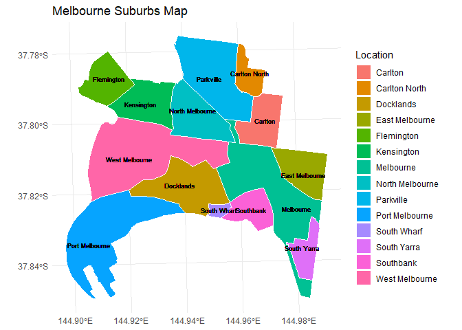

<!-- README.md is generated from README.Rmd. Please edit that file -->

# cafeMel

<!-- badges: start -->
<!-- badges: end -->

The **cafeMel** package is build under the context and instruction of
the course ETC5523-2024: Communication with Data. This package is a
simple package that provides functions to explore the data of coffee
business in Melbourne in the period from 2002 to 2022. An interactive
shiny app is also included in the package to help users to explore
census data and information of coffee shops, observing any interactive
characteristic in the industry.

## Installation

To install the development version of **cafeMel** package from GitHub,
follow this code:

``` r
# install.packages("remotes")
install_github("ETC5523-2024/assignment-4-packages-and-shiny-apps-anhLe68")
```

## Example

This example gives the overview map of Melbourne suburbs locations.

``` r
library(cafeMel)
library(dplyr)
#> 
#> Attaching package: 'dplyr'
#> The following objects are masked from 'package:stats':
#> 
#>     filter, lag
#> The following objects are masked from 'package:base':
#> 
#>     intersect, setdiff, setequal, union
library(ggplot2)
library(sf)
#> Linking to GEOS 3.12.1, GDAL 3.8.4, PROJ 9.3.1; sf_use_s2() is TRUE

vic_coffee_map |> 
  group_by(Location) |>
  ggplot() +
  geom_sf(aes(fill = Location), color = "white", size = 1) +
  geom_sf_text(aes(label = Location), size = 2.5) +
  theme_minimal() +
  theme(axis.title.y = element_blank(), 
        axis.title.x = element_blank()) +
  labs(title = "Melbourne Suburbs Map")
```



You’ll still need to render `README.Rmd` regularly, to keep `README.md`
up-to-date. `devtools::build_readme()` is handy for this.
